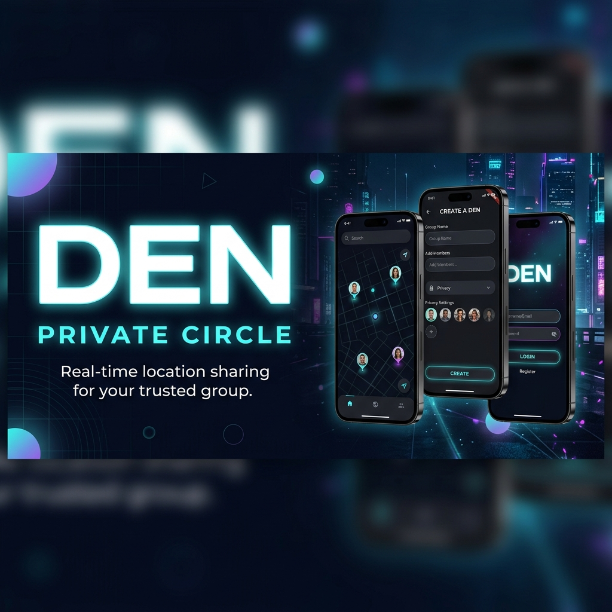
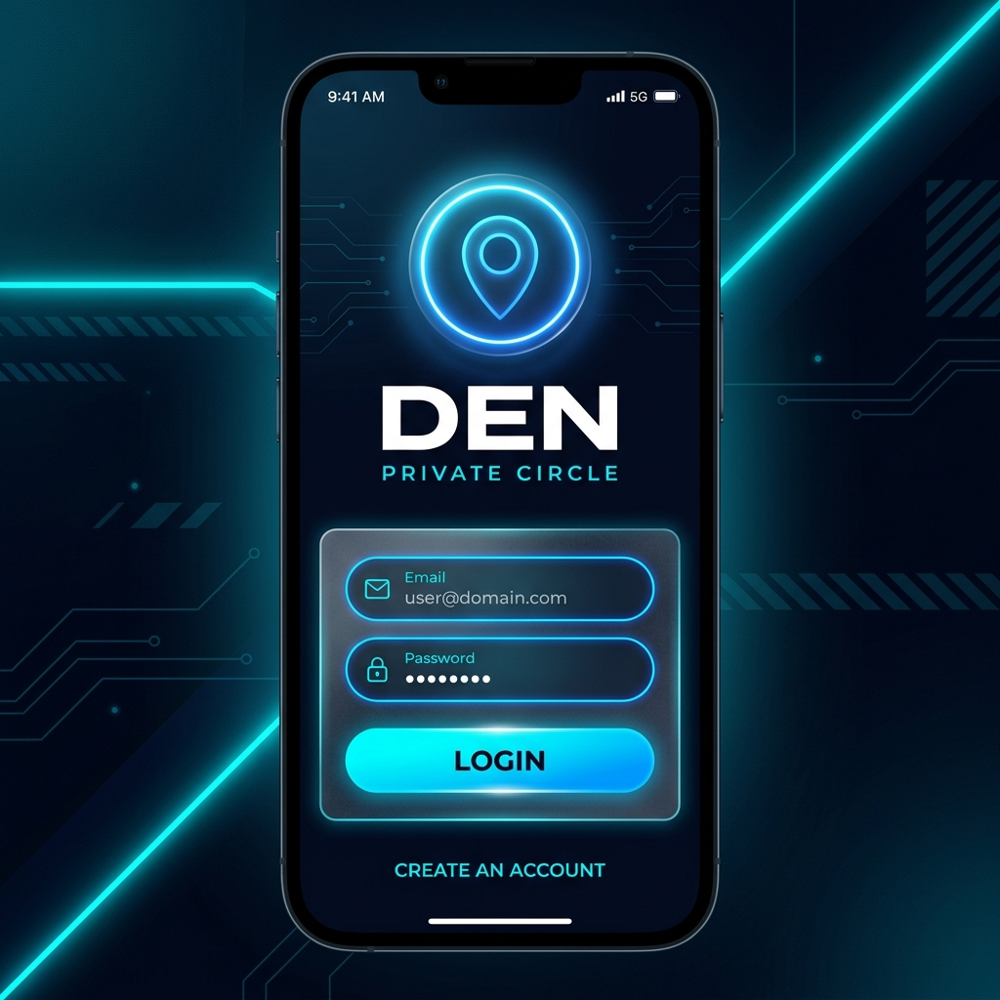
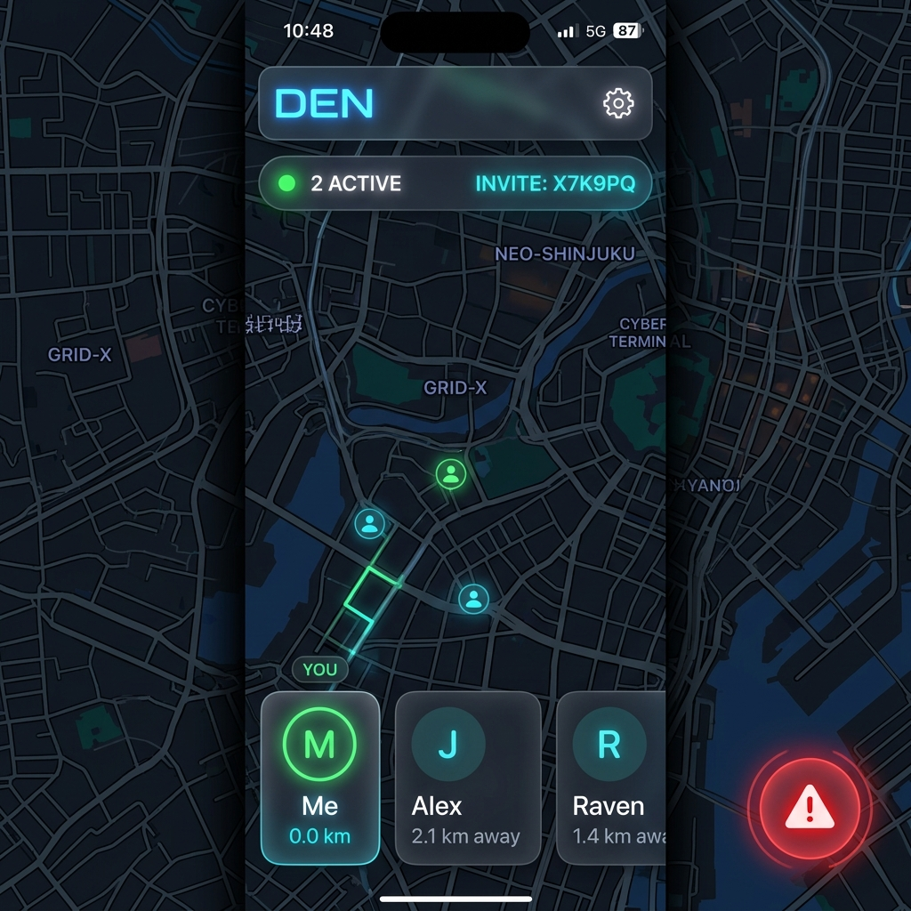
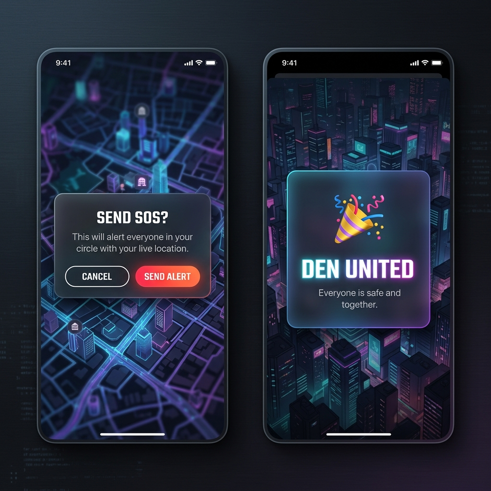

# DEN – Private Circle

<p align="center">
  
</p>

<h1 align="center">DEN – Private Circle</h1>

<p align="center">
  <strong>Real-time location sharing for your trusted group. Stay connected. Stay safe.</strong>
</p>

<p align="center">
  <a href="https://den-app-production.web.app">🌐 Live Demo</a>
  &nbsp;•&nbsp;
  <a href="https://github.com/Raneesh73/DEN">📦 GitHub Repository</a>
</p>

<p align="center">
  <a href="https://flutter.dev"></a>
  <a href="https://firebase.google.com"></a>
  <a href="https://riverpod.dev"></a>
  <a href="https://dart.dev"></a>
  
  
</p>

---

## 💡 Why DEN?

DEN was built as a real-time private safety and coordination platform for trusted groups such as families, friends, travel teams, and close communities.

The goal is to create a secure and emotionally connected experience where members can:

* view each other’s live locations
* receive proximity awareness
* trigger SOS alerts
* stay connected in real time

DEN combines the concept of private social circles with modern real-time safety infrastructure.

---

## 🌐 Live Demo

### 🚀 Public Web App

[https://den-app-production.web.app](https://den-app-production.web.app)

### 📦 GitHub Repository

[https://github.com/Raneesh73/DEN](https://github.com/Raneesh73/DEN)

---

## 📱 Screenshots

<p align="center">
  
  &nbsp;
  
  &nbsp;
  
  &nbsp;
  
</p>

---

## ✨ Features

| Feature | Description |
|---|---|
| 🗺️ **Live Map Dashboard** | Full-screen Google Maps with custom dark theme, real-time member markers, and smooth camera tracking |
| 👥 **Multi-Den System** | Manage up to 3 private circles (Dens) simultaneously. Seamlessly switch active circles with one tap |
| 💬 **Quick Messages** | Send ephemeral 15-second "Quick Messages" that appear directly over your map marker for instant context |
| 🔐 **Firebase Authentication** | Secure email/password auth with persistent session handling, password reset, and profile creation |
| 📍 **Real-Time Location Sync** | Background GPS via Geolocator streams live coordinates to Firestore for active circle members |
| 🚨 **SOS Alert System** | High-priority emergency broadcast that alerts your entire circle with live location updates |
| 👤 **Profile Management** | Customize your identity with unique usernames, bios, and real-time status updates |
| 🌙 **Premium Cyberpunk UI** | Glassmorphism cards, neon accents, animated backgrounds, and smooth micro-animations |
| ⚡ **Riverpod Architecture** | Fully reactive state with StreamProviders, StateNotifiers, and zero unnecessary rebuilds |

---

## 🛠️ Tech Stack

```text
Frontend         Flutter 3.x + Dart 3.x
State            Riverpod 2.x
Backend          Firebase Authentication + Cloud Firestore
Maps             Google Maps Flutter SDK + Maps JavaScript API
Location         Geolocator 14.x
UI               flutter_animate + glassmorphism + google_fonts
Platform         Android + Web
Deployment       Firebase Hosting
```

---

## 🏗️ Architecture

DEN follows a scalable feature-first architecture with clear separation between:

* UI layer
* state management
* services
* Firebase data layer

```text
UI Layer
   ↓
Riverpod Providers
   ↓
Services Layer
   ↓
Firebase + Geolocator
```

### Real-Time Data Flow

```text
GPS Device Location
        ↓
Geolocator Stream
        ↓
Map Provider
        ↓
Firestore Location Update
        ↓
Realtime Firestore Snapshot
        ↓
Live Map Marker Update
```

---

## 📁 Project Structure

```text
DEN/
├── android/
├── web/
├── assets/
│   └── screenshots/
├── lib/
│   ├── core/
│   ├── features/
│   ├── models/
│   ├── providers/
│   ├── services/
│   ├── utils/
│   ├── widgets/
│   ├── firebase_options.dart
│   ├── app.dart
│   └── main.dart
├── test/
├── firebase.json
├── pubspec.yaml
└── README.md
```

---

## 🔥 Firestore Data Model

### users/{uid}

```text
uid
name
email
denId
latitude
longitude
lastUpdated
```

### dens/{denId}

```text
id
name
createdBy
createdAt
inviteCode
```

---

## 🚀 Getting Started

### Prerequisites

* Flutter SDK ≥ 3.x
* Firebase account
* Google Maps API key
* Android Studio / VS Code

---

## 1️⃣ Clone Repository

```bash
git clone https://github.com/Raneesh73/DEN.git
cd DEN
flutter pub get
```

---

## 2️⃣ Configure Firebase

Install FlutterFire CLI:

```bash
dart pub global activate flutterfire_cli
```

Configure Firebase:

```bash
flutterfire configure
```

Enable:

* Firebase Authentication
* Cloud Firestore
* Firebase Hosting

---

## 3️⃣ Configure Google Maps

### Android

Add your Maps API key inside:

```text
android/app/src/main/AndroidManifest.xml
```

### Web

Add your Maps API key inside:

```text
web/index.html
```

⚠️ Important:
Always restrict your API keys in Google Cloud Console before deploying publicly.

---

## ▶️ Run The App

### Android

```bash
flutter run
```

### Web

```bash
flutter run -d chrome
```

---

## 📦 Production Builds

### Android APK

```bash
flutter build apk --release
```

APK Output:

```text
build/app/outputs/flutter-apk/app-release.apk
```

### Flutter Web

```bash
flutter build web --release
```

---

## 🌐 Deployment

### Firebase Hosting

```bash
firebase login
firebase init hosting
flutter build web
firebase deploy --only hosting
```

Live URL:

[https://den-app-production.web.app](https://den-app-production.web.app)

---

## 🔒 Security Notes

Before making the repository public:

✅ Restrict Google Maps API keys
✅ Configure Firestore security rules
✅ Avoid committing Firebase secrets
✅ Use environment configuration for sensitive keys

Recommended Firestore Rules:

```javascript
rules_version = '2';
service cloud.firestore {
  match /databases/{database}/documents {
    match /users/{userId} {
      allow read, write: if request.auth != null;
    }

    match /dens/{denId} {
      allow read, write: if request.auth != null;
    }
  }
}
```

---

## 📈 Future Improvements

- [x] **Multi-Den Support** — Manage multiple circles simultaneously
- [x] **Quick Messages** — 15s ephemeral map marker messages
- [x] **Profile Editing** — Unique usernames and bios
- [ ] **Push Notifications** — FCM alerts when SOS is triggered
- [ ] **Custom Avatars** — Profile photo upload via Firebase Storage
- [ ] **Location History** — Breadcrumb trail for the last N hours
- [ ] **Geofencing** — Alerts when a member enters/exits a defined zone
- [ ] **iOS Support** — Full Apple Maps + Geolocator support

---

## 🧪 Quality Metrics

| Check                 | Result     |
| --------------------- | ---------- |
| flutter analyze       | ✅ 0 issues |
| Android Release Build | ✅ Working  |
| Flutter Web Build     | ✅ Deployed |
| Firebase Integration  | ✅ Stable   |
| Null Safety           | ✅ Enabled  |
| Realtime Sync         | ✅ Working  |
| Maps Rendering        | ✅ Working  |

---

## 👨‍💻 Developer

**Raneesh**

Built with Flutter, Firebase, and real-time systems engineering.

GitHub:
[https://github.com/Raneesh73](https://github.com/Raneesh73)

---

## 📄 License

MIT License © 2026

Built with ❤️ using Flutter + Firebase.
